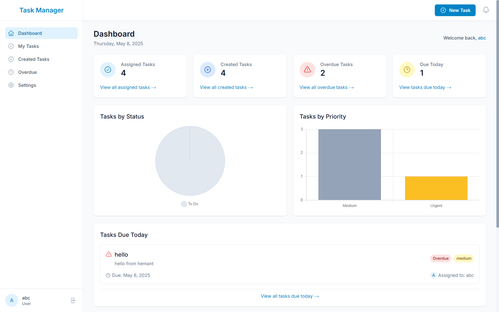

# Task Management System

A comprehensive task management application for teams with real-time collaboration, analytics, and offline support.



**Live Demo**: [https://task-management-chi-wheat.vercel.app/](https://task-management-chi-wheat.vercel.app/)

## 🚀 Quick Start

### Prerequisites

- Node.js (v18+)
- MongoDB
- npm or yarn

### Installation

1. Clone the repository

```bash
git clone https://github.com/Hmtgit7/task-management.git
cd task-management
```

2. Set up the backend

```bash
cd backend
npm install
cp .env.example .env
# Edit .env with your MongoDB connection string and JWT secret
npm run dev
```

3. Set up the frontend

```bash
cd ../frontend
npm install
cp .env.example .env.local
# Edit .env.local with your backend API URL
npm run dev
```

4. Open your browser and navigate to [http://localhost:3000](http://localhost:3000)

## 🔍 Common Issues & Solutions

### No Tasks Displaying
If you're seeing "No description provided," "Unassigned," etc. when viewing tasks:

1. Ensure MongoDB is running and properly connected
2. Check that your JWT authentication is working properly
3. Verify tasks have been created in the database
4. Check browser console for API errors

### Guest Mode Not Working
If guest login fails:

1. Ensure the auth middleware properly handles the 'guest-token'
2. Check the authentication controller for the guest login flow

### Connection Issues
If you see "Not authorized to access this route" errors:

1. Verify your JWT token is being passed correctly in the Authorization header
2. Check that the token is not expired
3. Ensure your CORS settings allow connections from your frontend URL

## 🌟 Features

- **User Authentication**: Secure user registration and login with JWT
- **Task Management**: Create, view, update, and delete tasks
- **Team Collaboration**: Assign tasks to team members with real-time notifications
- **Dashboard**: View assigned tasks, created tasks, and overdue tasks
- **Analytics**: Visualize task metrics and team performance
- **Real-Time Updates**: Socket.IO for instant notifications
- **Offline Support**: Progressive Web App (PWA) functionality
- **Role-Based Access**: Admin, Manager, and User roles

## 🛠️ Tech Stack

### Backend
- Node.js, Express, MongoDB
- JWT Authentication
- Socket.IO for real-time updates

### Frontend
- Next.js (React)
- Tailwind CSS
- Zustand for state management
- Chart.js for analytics

## 📁 Project Structure

```
task-management/
├── backend/          # Express.js API server
├── frontend/         # Next.js frontend application
├── README.md         # Main documentation
└── .gitignore        # Git ignore file
```

## 🤝 Contributing

1. Fork the repository
2. Create your feature branch (`git checkout -b feature/amazing-feature`)
3. Commit your changes (`git commit -m 'Add some amazing feature'`)
4. Push to the branch (`git push origin feature/amazing-feature`)
5. Open a Pull Request

## 📝 License

This project is licensed under the MIT License - see the [LICENSE](LICENSE) file for details.